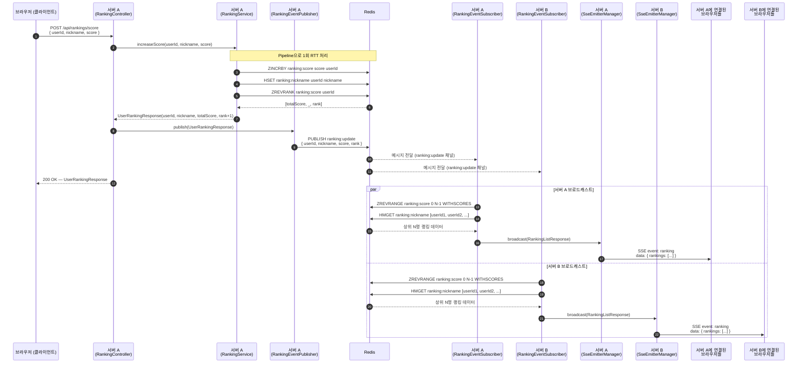
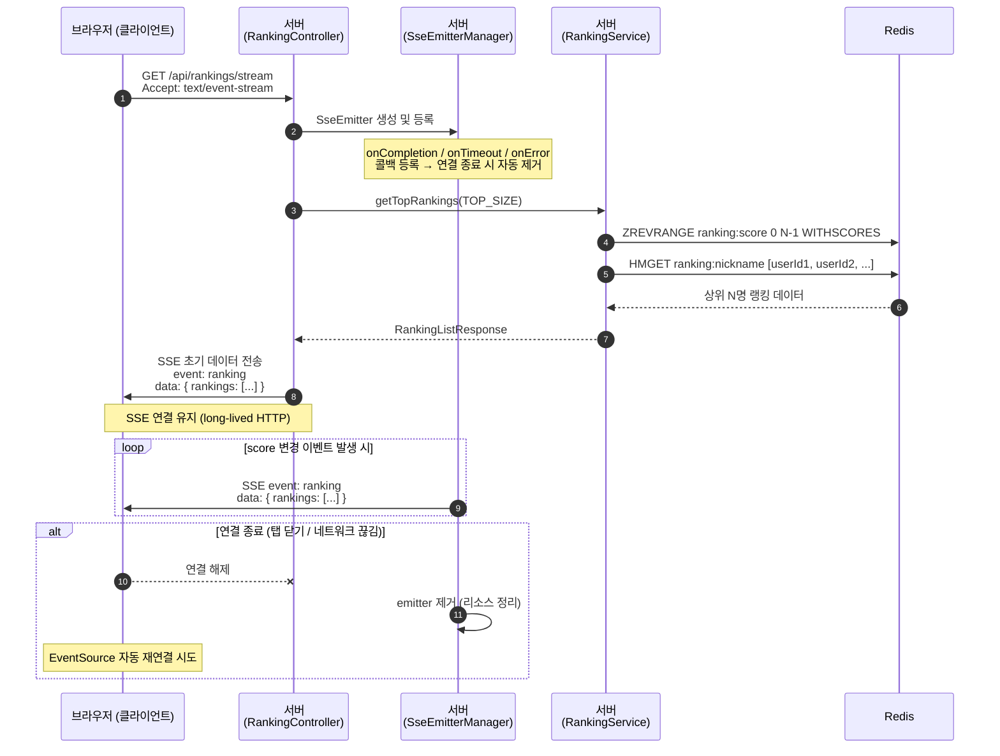

# 실시간 랭킹 시스템 흐름도

## 1. 점수 업데이트 및 실시간 브로드캐스트 흐름

```mermaid
sequenceDiagram
    autonumber
    participant Browser as 브라우저 (클라이언트)
    participant ServerA as 서버 A<br/>(RankingController)
    participant ServiceA as 서버 A<br/>(RankingService)
    participant PublisherA as 서버 A<br/>(RankingEventPublisher)
    participant Redis as Redis
    participant SubA as 서버 A<br/>(RankingEventSubscriber)
    participant SubB as 서버 B<br/>(RankingEventSubscriber)
    participant SseA as 서버 A<br/>(SseEmitterManager)
    participant SseB as 서버 B<br/>(SseEmitterManager)
    participant BrowsersA as 서버 A에 연결된<br/>브라우저들
    participant BrowsersB as 서버 B에 연결된<br/>브라우저들

    Browser->>ServerA: POST /api/rankings/score<br/>{ userId, nickname, score }

    ServerA->>ServiceA: increaseScore(userId, nickname, score)

    Note over ServiceA, Redis: Pipeline으로 1회 RTT 처리
    ServiceA->>Redis: ZINCRBY ranking:score score userId
    ServiceA->>Redis: HSET ranking:nickname userId nickname
    ServiceA->>Redis: ZREVRANK ranking:score userId
    Redis-->>ServiceA: [totalScore, _, rank]

    ServiceA-->>ServerA: UserRankingResponse(userId, nickname, totalScore, rank+1)

    ServerA->>PublisherA: publish(UserRankingResponse)
    PublisherA->>Redis: PUBLISH ranking:update<br/>{ userId, nickname, score, rank }

    Redis-->>SubA: 메시지 전달 (ranking:update 채널)
    Redis-->>SubB: 메시지 전달 (ranking:update 채널)

    ServerA-->>Browser: 200 OK — UserRankingResponse

    par 서버 A 브로드캐스트
        SubA->>Redis: ZREVRANGE ranking:score 0 N-1 WITHSCORES
        SubA->>Redis: HMGET ranking:nickname [userId1, userId2, ...]
        Redis-->>SubA: 상위 N명 랭킹 데이터
        SubA->>SseA: broadcast(RankingListResponse)
        SseA->>BrowsersA: SSE event: ranking<br/>data: { rankings: [...] }
    and 서버 B 브로드캐스트
        SubB->>Redis: ZREVRANGE ranking:score 0 N-1 WITHSCORES
        SubB->>Redis: HMGET ranking:nickname [userId1, userId2, ...]
        Redis-->>SubB: 상위 N명 랭킹 데이터
        SubB->>SseB: broadcast(RankingListResponse)
        SseB->>BrowsersB: SSE event: ranking<br/>data: { rankings: [...] }
    end
```

---

## 2. SSE 구독 연결 흐름

```mermaid
sequenceDiagram
    autonumber
    participant Browser as 브라우저 (클라이언트)
    participant Controller as 서버<br/>(RankingController)
    participant SseManager as 서버<br/>(SseEmitterManager)
    participant Service as 서버<br/>(RankingService)
    participant Redis as Redis

    Browser->>Controller: GET /api/rankings/stream<br/>Accept: text/event-stream

    Controller->>SseManager: SseEmitter 생성 및 등록
    Note over SseManager: onCompletion / onTimeout / onError<br/>콜백 등록 → 연결 종료 시 자동 제거

    Controller->>Service: getTopRankings(TOP_SIZE)
    Service->>Redis: ZREVRANGE ranking:score 0 N-1 WITHSCORES
    Service->>Redis: HMGET ranking:nickname [userId1, userId2, ...]
    Redis-->>Service: 상위 N명 랭킹 데이터
    Service-->>Controller: RankingListResponse

    Controller->>Browser: SSE 초기 데이터 전송<br/>event: ranking<br/>data: { rankings: [...] }

    Note over Browser, Controller: SSE 연결 유지 (long-lived HTTP)

    loop score 변경 이벤트 발생 시
        SseManager->>Browser: SSE event: ranking<br/>data: { rankings: [...] }
    end

    alt 연결 종료 (탭 닫기 / 네트워크 끊김)
        Browser--xController: 연결 해제
        SseManager->>SseManager: emitter 제거 (리소스 정리)
        Note over Browser: EventSource 자동 재연결 시도
    end
```
